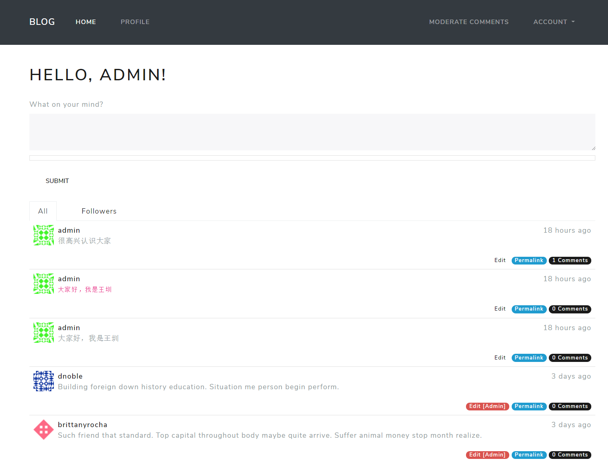
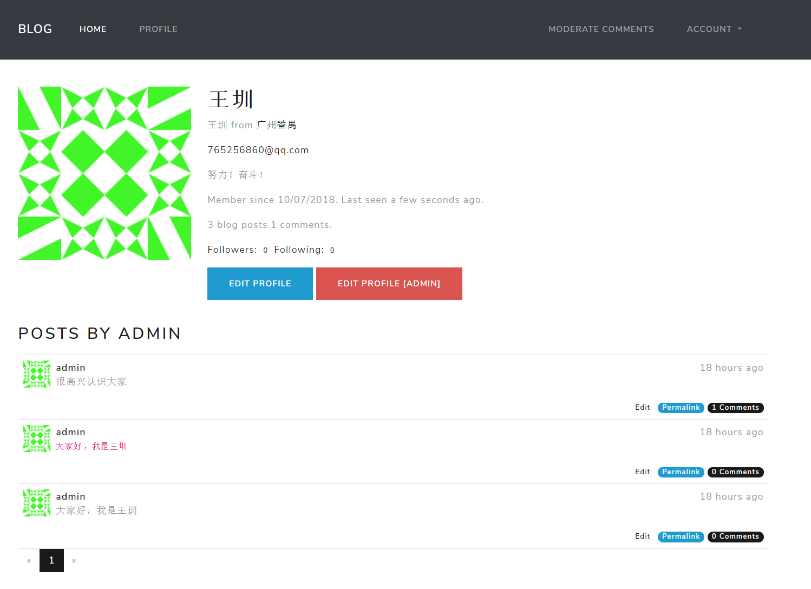

# 博客项目

Demo：http://blog.wangzhen.live/

## 项目介绍

通过 `Flask `框架实现如注册帐号、登录、邮箱认证、发帖、评论、用户间互相关注、管理员权限管理、 个人资料编辑等博客的基本功能。博客是典型的 CMS （内容管理系统），由两部分：一是博客前台， 即展示给所有用户的博客内容；二是博客后台，这部分内容只开放给博客管理员，用来对博客资源进 行修改，对用户权限进行设置。 

## 项目结构
```
| -blog
  | -app/  # 程序包，用于存储所有代码、模板和静态文件
    | -templates/  # 模板文件
    | -main/  # 博客的主要逻辑
      | -__init__.py  # 创建蓝本
      | -errors.py  # 错误处理
      | -forms.py  # 表单
      | -views.py  # 视图函数
    | -auth/  # 认证逻辑
      | -__init__.py  # 创建蓝本
      | -forms.py
      | -views.py
    | -static/  # 静态文件
      | -css/
      | -js/
    | -__init__.py  # 工厂函数及注册蓝本
    | -email.py  # 邮件部分
    | -models.py  # 数据模型
    | -fake.py  # 生成虚拟数据
    | -decorators.py  # 装饰器
  | -migrations/  # 数据库迁移
  | -wsgi.py  # 启动程序
  | -config.py  # 存储配置
  | -.env  # 私有的环境变量
  | -.flaskenv  # 可公开的环境变量
```

## 项目截图



